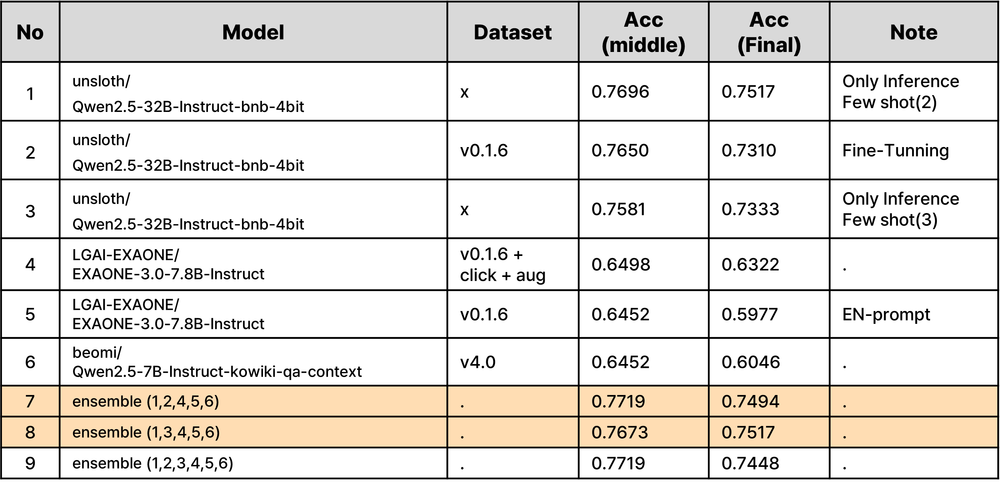

# 수능형 문제 풀이 모델 생성

### :100: 대회 소개

생성형 모델을 사용한 자연어처리 대회로써 "한국어"와 "시험"이라는 주제에 맞춰서 작은 모델들로 수능 시험을 풀이하는 대회

* 데이터 구성
  * 학습 데이터 : KMMLU / MMMLU / KLUE MRC (2031개)
  * 평가 데이터 : 수능형 문제 + KMMLU / MMMLU / KLUE MRC (869개)
* 평가지표
  * $$\text{Accuracy}=\dfrac{\text{Number of Correct Predictions}}{\text{Total Number of Predictions}}$$
* 기간 : 2024.11.13 ~ 2024.11.28
* [Wrap-up Report](./assets/figure/NLP_10_Generation_for_nlp_wrapreport.pdf)

### :star: 리더 보드

#### Private Leader Board (7위)


### :hugs: 멤버

| **팀원**                                                     | **역할**                                                     |
| ------------------------------------------------------------ | ------------------------------------------------------------ |
| 강경준 <a href="https://github.com/kangjun205"></a> | EDA(Label 분석, 데이터 유형 분석), 데이터 수집 및 전처리(CLIcK Data), Reasoning(Orca) |
| 권지수 <a href="https://github.com/JK624"></a> | 데이터 수집(Crawling), 데이터 정제(kiwi)                     |
| 김재겸 <a href="https://github.com/rlaworua5667"></a> | 데이터 증강, 데이터 실험(Fine-Tuning), 모델 실험(Fine-Tuning) |
| 박동혁 <a href="https://github.com/someDeveloperDH"></a> | Prompt-Reasoning(연역적, 귀납적, 단계적 추론 ), baseline 모듈화 |
| 이인설 <a href="https://github.com/leeinseol"></a> | Domain-Adaptive Fine-Tuning, RAG 구현(Korean Textbooks), baseline 모듈화 |
| 이정휘 <a href="https://github.com/LeeJeongHwi"></a> | Model 탐색, Prompt 작성(Few-Shot, EN-Prompt), RAG 구현(Wikipedia) |


### :open_file_folder: 폴더 구조

```
📦level2-nlp-generationfornlp-nlp-10-lv3
 ┣ 📂assets
 ┣ 📂configs
 ┣ 📂data
 ┣ 📂data_loader
 ┃ ┣ 📜datasets.py
 ┃ ┗ 📜rag_datasets.py
 ┣ 📂demo_streamlit
 ┣ 📂EDA
 ┣ 📂fine_tuning
 ┃ ┣ 📂configs
 ┃ ┃ ┗ 📜ft_baseline.yaml
 ┃ ┣ 📂scripts
 ┃ ┃ ┗ 📜ft_baseline.sh
 ┃ ┗ 📜ft_main.py
 ┣ 📂models
 ┃ ┣ 📜base_model.py
 ┃ ┗ 📜fine_tuning_model.py
 ┣ 📂RAG
 ┃ ┣ 📂korean_textbooks
 ┃ ┃ ┣ 📜inference_korean_textbooks.py
 ┃ ┃ ┣ 📜korean_textbooks_dataset.py
 ┃ ┃ ┗ 📜vectorStore_kortextbook.py
 ┃ ┣ 📂wikipedia
 ┃ ┃ ┣ 📜inference_rag.py
 ┃ ┃ ┣ 📜retrieval.py
 ┃ ┃ ┣ 📜train_rag.py
 ┃ ┃ ┣ 📜vectorStore.py
 ┃ ┃ ┗ 📜wikipedia_dataset.py
 ┃ ┗ 📜milvus_database.py
 ┣ 📂Reasoning
 ┃ ┣ 📜configs.yaml
 ┃ ┣ 📜generate_reasoning.py
 ┃ ┣ 📜gen_configs.yaml
 ┃ ┣ 📜prompts.yaml
 ┃ ┣ 📜reasoning_train.py
 ┃ ┗ 📜test.py
 ┣ 📂scripts
 ┃ ┣ 📜inference_baseline.sh
 ┃ ┗ 📜train_baseline.sh
 ┣ 📂utils
 ┃ ┣ 📜augmentation.py
 ┃ ┣ 📜click_dataset_loader.py
 ┃ ┣ 📜metrics.py
 ┃ ┗ 📜utils.py
 ┣ 📜.gitignore
 ┣ 📜.gitmessage.txt
 ┣ 📜inference.py
 ┣ 📜README.md
 ┣ 📜requirements.txt
 ┗ 📜train.py
```

* `train.py`, `inference.py` : Fine-Tuning과 추론하는 Baseline 코드
  * `scripts`에 있는 shell script를 실행하여 파일 실행

```shell
bash scripts/train_baseline.sh configs/{config_file} # bash 사용
python train.py --config_path={config_file} # Python 사용
```

* `RAG`의 train과 inference 파일을 따로 구성하였음
  * `rag_datasets`는 `hint prompt`를 사용하는 코드가 포함되어있음
  * 실행은 기존 train을 실행하는 것과 동일함


### :bulb:주요 접근 방식

| 과정              | 내용                                                         |
| ----------------- | ------------------------------------------------------------ |
| EDA               | - 각 데이터셋 마다의 지문,질문,선지를 포함한 문자 길이 파악<br />- 실제 문제를 보았을 때 지문만으로 풀 수 있는 문제인지 수작업으로 문제 검수<br />- 선지와 지문(질문)이 연관이 없는 문제인지 검수 |
| 데이터 전처리     | - EDA를 기반으로 지문, 질문, 선지간의 연관이 없는 문제와 눈으로 보았을 때 풀 수 없는 문제를 비정상데이터로 간주하여 삭제<br />- 이메일, url, 전화번호, 기자 정보와 같이 불필요한 정보 제거<br />- 잘못된 띄어쓰기를 kiwi를 사용하여 재배치 |
| 증강              | - CLIcK 데이터를 사용하여 데이터를 증강<br />- 지문이 누락된 경우 질문으로 지문을 채워 정제함<br />- 각 지문을 이용해서 GPT-4o-mini를 활용하여 수능형 문제를 생성하는 방식으로 문제와 선지를 생성함<br />- answer의 편향이 발생하는 것을 방지하기 위해 answer를 골고루 제공한 prompt 사용 |
| RAG               | - Wikipedia, Korean Textbooks를 기반으로 Vector DB를 구축하고  Query(지문,질문,선지를 포함)를 주어 Cosine 유사도 검사 수행<br />- Retrieve한 문장은 Hint로 간주하고 Query에 추가하여 최종적으로 Prompt + Query + Hint로 Generation 수행 |
| Pre-train         | - Domain-Adaptive Fine-Tuning with LoRA로 AiHub, 우리역사넷에서 한국사, 한국 경제 등의 사전 지식등을 사전 학습<br /> |
| High Parameter LM | - Unsloth Package를 활용하여 `unsloth/Qwen2.5-32B-Instruct-bnb-4bit` 모델을 사용<br />- few-shot 기반으로 추론만 수행 |
| 앙상블            | - Weighted Hard Voting을 수행                                |


### :page_facing_up: ​결과



* 중간 순위 정확도 기준으로 `0.7719`로 가장 높은 두 모델을 최종 모델로 제출했으나, `0.7673`을 기록했던 모델인 `ensemble(1,3,4,5,6)` 이 가장 높은 결과 (`0.7517`)를 기록

