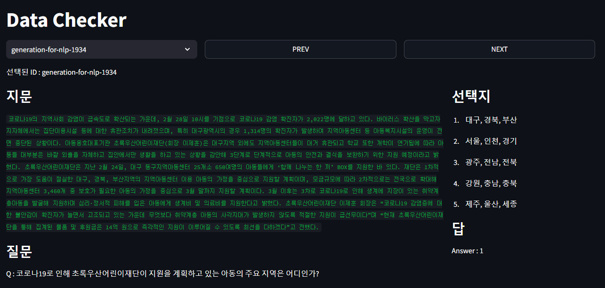

# Streamlit Demo

## Overview
* 데이터를 쉽게 확인하기 위함과 추후 모델링이 어느정도 완성되면, 모델 결과도 비교할 수 있도록 기반을 만들어 두는 역할

## How to Use
* Streamlit Package 설치  
  ```shell
  $ pip install streamlit
  ```

* aistage에서 생성한 서버를 기반으로 허용되는 port번호를 `run.sh` 파일에 수정해준다.  

  ```shell
    streamlit run app.py --global.developmentMode false --server.port={PortNumber}
  ```
  
* `run.sh`를 실행  

  ```shell
    $ bash run.sh
  ```

* `http://localhost:{portNumber}` 로 접속 후 사용

## Component

* `SelectBox`에서 보고자하는 데이터를 선택해서 확인 가능
* `PREV Button`으로 이전 ID 데이터를 확인 가능
* `NEXT Button`으로 다음 ID 데이터를 확인 가능

## Preview

 
